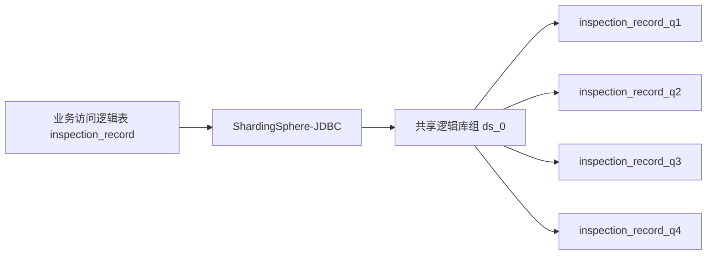
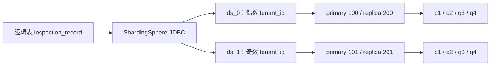

# 资产点巡检 ShardingSphere-JDBC 实战 Demo

这个项目把资产点巡检记录从 legacy **单库单表**演进为一套可产品化交付的方案：

- 表维度始终使用 4 张固定季度槽位表：`inspection_record_q1`～`inspection_record_q4`。
- 标准版部署时 `sharding.enabled=false`，所有租户共享单个逻辑库组，但仍按季度分表。
- 大客户部署时 `sharding.enabled=true`，再按固定分片键 `tenant_id` 分库；每个分片库仍只有 4 张季度表。
- 每个逻辑库组可配置一主一从，普通读走 replica，写与强一致读走 primary。

它用于理解和演练这条简历内容：

> 结合业务数据持续增长趋势提前进行容量预判，引入 ShardingSphere-JDBC 完成应用侧智能路由、读写分离和分库分表；按季度复用四张固定物理表，维护当前季度及前两个季度的在线热窗口，并将租户分库设计为部署期可选能力，使同一套代码同时支持标准版单库共享和大客户租户隔离部署。

## 先给结论：方案合理，但表述要准确

这套方案适合同时满足以下前提的点巡检业务：

1. 高频查询主要落在最近半年，较老数据允许归档后走历史查询链路。
2. 查询天然带 `tenant_id` 和时间范围，很少做跨租户在线聚合。
3. 季度数据量能将单表控制在已压测的范围内。
4. 产品交付前就能根据客户规模决定是否分库，交付后不会在线切换部署形态。

需要把三处口径说严谨：

- “保留 3 个季度”是**当前季度 + 前 2 个完整季度**。在当前季度刚开始时在线窗口略多于 6 个月，在季度结束前接近 9 个月，因此应说“完整覆盖最近半年、动态约 6～9 个月”，不能笼统说永远固定 9 个月。
- 季度切换后的 3 天宽限期内，旧槽位仅处于 `EXPIRED` 待归档状态，4 张表可能暂时都有数据；业务正常读写仍只能访问 3 个 `ACTIVE` 季度。
- `sharding.enabled` 是**部署启动选择**，不是运行期热切换开关。已有数据后改变它会改变路由，必须先完成存量重分布、增量同步、对账和切流。

“大多数客户 1～3 个租户、单表 500～1500 万行”可以作为容量假设，但不能直接等同于“性能一定稳定”。面试时应补充：用客户典型 SQL、索引大小、数据分布、并发量和目标 P99 做过压测后，才确定单表阈值和是否开启分库。

## 真实性边界

这是一个可运行的学习 Demo，不会自动证明真实生产规模或性能收益。

- 可以说：“我用 Demo 复现并验证了固定季度槽位、部署期分库选择和主从路由机制。”
- 只有存在真实监控或压测报告时，才能说具体 QPS、P99、迁移时长和性能提升百分比。
- 更准确的“统一管理主从”是：应用侧统一配置主从数据源并完成读写路由。MySQL 复制、故障选主、备份恢复和 HA 仍由数据库基础设施负责。
- `sharding.sharding-key=tenant_id` 是启动校验项，不代表运维可任意改为其他字段；代码、SQL、索引和存量数据均以 `tenant_id` 为固定分库键。

## 一个改造前基线 + 两种产品部署形态

### 1. Legacy：单库单表基线


这个形态用于观察改造前的问题和迁移来源，不是产品最终形态。

### 2. 标准版：单库共享 + 四张季度表

部署参数：

```properties
sharding.enabled=false
sharding.sharding-key=tenant_id
```



所有租户都路由到 `ds_0`，`record_date` 仍按日历季度路由到固定槽位。Demo 的 `ds_0` 带一主一从以便观察读写分离；实际轻量交付是否部署 replica 应由 SLA 决定。

### 3. 大客户版：租户分库 + 每库四张季度表

部署参数：

```properties
sharding.enabled=true
sharding.sharding-key=tenant_id
```



Demo 用 `% 2` 便于手算。生产是否使用取模、租户映射表或专属库，需要结合头部租户、扩容和迁移成本决定。

## 固定季度槽位与热窗口

物理表映射永远不变：

| 业务季度 | 物理表 |
|---|---|
| Q1（1～3 月） | `inspection_record_q1` |
| Q2（4～6 月） | `inspection_record_q2` |
| Q3（7～9 月） | `inspection_record_q3` |
| Q4（10～12 月） | `inspection_record_q4` |

例如配置：

```properties
demo.sharding.current-quarter=2026Q3
demo.sharding.retained-quarter-count=3
demo.sharding.purge-grace-days=3
```

此时在线季度是 `2026Q1`、`2026Q2`、`2026Q3`，对应 q1、q2、q3；q4 是已清空的待命槽位。仅仅计算 `record_date` 属于 Q1 还不够，算法还必须验证该年份季度是否位于当前热窗口，防止 `2025Q1` 与 `2026Q1` 因复用 q1 而误读。

### 从 2026Q3 切换到 2026Q4


切换期间的关键不变量：

- 新季度写入此前已清空的待命表，不在请求里动态改物理表名。
- 稳定态有 3 个 `ACTIVE` 槽位；ACTIVATE 到 EXPIRE 的受控切换窗口内，元数据会短暂出现 4 个 `ACTIVE`，但应用在线窗口仍只由 current + previous 2 决定。
- `EXPIRED` 只供宽限期核查，不再接收正常写。
- 3 天只是默认宽限，不是“到点自动 `TRUNCATE`”。必须先完成归档、对账并人工确认。
- 宽限期可能 4 张表都有数据，这不等于在线查询可以扫描 4 个季度。
- 表槽位固定避免了“配置滚动更新时不同实例对同一槽位理解不同”；季度窗口配置仍需版本化发布和滚动重启，不能让实例同时持有不同 `current-quarter`。

运维脚本入口：

```bash
./scripts/quarter-rollover.sh status
./scripts/quarter-rollover.sh prepare 2026Q4
./scripts/quarter-rollover.sh activate 2026Q4
./scripts/quarter-rollover.sh release-check 2026Q4
./scripts/quarter-rollover.sh expire 2026Q1
./scripts/quarter-rollover.sh purge 2026Q1
```

`release-check` 是发布 `CURRENT_QUARTER` 前的只读门禁；`purge` 必须在 3 天宽限、归档对账、流量栅栏、可恢复备份和人工确认之后执行。具体保护条件见脚本输出与 [迁移灰度与生产化](docs/02_迁移灰度与生产化.md)。

## 路由公式

| 层次 | 规则 | 标准版 | 大客户版 |
|---|---|---|---|
| 分库 | 部署规则 / `TenantDatabaseShardingAlgorithm` | 不配置分库策略，所有 tenant → `ds_0` | 自定义算法：偶数→`ds_0`，奇数→`ds_1` |
| 分表 | `FixedQuarterShardingAlgorithm` | Q1→q1，Q2→q2，Q3→q3，Q4→q4，并校验热窗口 | 相同 |
| 读写 | SQL/事务/Hint | 写、事务读、Hint→primary；普通读→replica | 相同 |
| 主键 | Snowflake | 避免多表 ID 冲突 | 避免多库多表 ID 冲突 |

以当前季度 `2026Q3` 为例：

| 部署模式与条件 | 预期库 | 预期表 | 普通读 | 写/强一致读 |
|---|---|---|---|---|
| 标准版，tenant=3，2026-07-18 | `ds_0` | `inspection_record_q3` | 200 | 100 |
| 大客户版，tenant=2，2026-07-18 | `ds_0` | `inspection_record_q3` | 200 | 100 |
| 大客户版，tenant=3，2026-07-18 | `ds_1` | `inspection_record_q3` | 201 | 101 |
| 大客户版，tenant=3，`[2026-06-29, 2026-07-02)` | `ds_1` | q2、q3 | 201 | 101 |

## 核心实现入口

```text
src/main/java/com/example/assetinspection/
├── config/                         # 部署开关、季度热窗口配置与启动校验
├── algorithm/
│   ├── tenant/TenantDatabaseShardingAlgorithm.java
│   └── quarter/                       # BusinessQuarter、热窗口与固定季度算法
├── context/                        # X-Tenant-Id → ThreadLocal
├── api/                            # 业务接口、预期路由与教学反例
├── service/                        # 路由条件、强一致读、游标分页、乐观锁
├── mapper/                         # MyBatis Mapper
└── migration/                      # legacy 回填与对账

src/main/resources/
├── application-legacy.properties
├── application-product.properties  # 产品形态；读取 sharding.enabled
├── application-sharding.properties # 大客户模式兼容别名
├── shardingsphere-standard.yaml      # 标准版：共享 ds_0
├── shardingsphere-tenant.yaml        # 大客户版：tenant_id 分库
└── mapper/InspectionRecordMapper.xml
```

重点类：

- `ProductDataSourceConfiguration`：启动时读取部署开关，并一次性选择标准版或租户分库 YAML。
- `TenantDatabaseShardingAlgorithm`：仅在大客户规则中按 tenant_id 选择 ds_0/ds_1。
- `FixedQuarterShardingAlgorithm`：根据 record_date 计算日历季度、验证 ACTIVE 热窗口并选择 q1～q4。
- `ExpectedRouteService`：在不访问数据库时展示预期部署模式、库、季度和槽位。
- `InspectionRecordService`：保证每条在线 SQL 带 tenant_id 和 record_date/范围。

## 运行前提

```bash
java -version
mvn -version
docker --version
docker compose version
```

建议 JDK 8、Maven 3.6+、Docker Desktop 24+。进入目录：

```bash
git clone https://github.com/roy-imi/techPractice-ShardingSphere-JDBC---demo.git
cd techPractice-ShardingSphere-JDBC---demo
mvn test
mvn -DskipTests package
./scripts/start-databases.sh
./scripts/verify-physical-data.sh
```

`replication-setup` 最终显示 `Exited (0)` 代表初始化成功。

> 安全提示：仓库中的 `root-password`、`asset-password` 都是仅供本机 Docker 教学环境使用的公开示例值，数据库端口和 Spring Boot API 默认都只绑定 `127.0.0.1`。生产环境必须改用 Secret Manager 或部署平台密钥，关闭危险实验接口，并补齐认证、授权和网络边界。

## 运行改造前基线与两种产品形态

每次只启动一个应用进程，端口均为 `18080`。

### Legacy

```bash
mvn spring-boot:run -Dspring-boot.run.profiles=legacy
```

### 标准版（默认产品形态）

```bash
mvn spring-boot:run \
  -Dspring-boot.run.profiles=product \
  -Dspring-boot.run.arguments="--sharding.enabled=false --demo.sharding.current-quarter=2026Q3"
```

也可以使用环境变量部署：

```bash
SHARDING_ENABLED=false \
CURRENT_QUARTER=2026Q3 \
mvn spring-boot:run -Dspring-boot.run.profiles=product
```

### 大客户版

```bash
mvn spring-boot:run \
  -Dspring-boot.run.profiles=product \
  -Dspring-boot.run.arguments="--sharding.enabled=true --sharding.sharding-key=tenant_id --demo.sharding.current-quarter=2026Q3"
```

兼容入口 `--spring.profiles.active=sharding` 默认等价于开启租户分库，但生产交付建议统一用 `product` profile 加显式部署参数。

## 核心实验

### 1. 先手算预期路由

```bash
curl -sS \
  'http://localhost:18080/api/debug/routes/expected?tenantId=3&startDate=2026-07-01&endDateExclusive=2026-08-01'
```

大客户模式预期包含：

```json
{
  "deploymentMode": "TENANT_DATABASE",
  "tenantDatabaseShardingEnabled": true,
  "logicalDataSource": "ds_1",
  "physicalTables": ["inspection_record_q3"]
}
```

标准版的 `deploymentMode` 应是 `SHARED_DATABASE`，同一 tenant 仍落 `ds_0`。

### 2. 创建 Q3 记录

```bash
curl -sS -X POST 'http://localhost:18080/api/inspection-records' \
  -H 'Content-Type: application/json' \
  -H 'X-Tenant-Id: 3' \
  -d '{
    "requestId":"demo-t3-2026q3-001",
    "assetId":10002,
    "assetCode":"PUMP-002",
    "inspectionPointId":502,
    "inspectionPointName":"电机温度",
    "recordDate":"2026-07-18",
    "inspectedAt":"2026-07-18T10:00:00",
    "status":"ABNORMAL",
    "measuredValue":92.6,
    "unit":"℃",
    "resultDescription":"温度偏高，待复检",
    "inspectorId":9002
  }'
```

大客户模式日志应出现：

```text
ds1_primary ::: INSERT INTO inspection_record_q3 ...
```

标准版则是 `ds0_primary ::: inspection_record_q3`。复制响应里的 `id`，后文以 `YOUR_ID` 表示。

### 3. 对比普通读、事务读和 Hint 读

```bash
curl -sS -H 'X-Tenant-Id: 3' \
  'http://localhost:18080/api/inspection-records/YOUR_ID?recordDate=2026-07-18'

curl -sS -H 'X-Tenant-Id: 3' \
  'http://localhost:18080/api/inspection-records/YOUR_ID/strong?recordDate=2026-07-18'

curl -sS -H 'X-Tenant-Id: 3' \
  'http://localhost:18080/api/inspection-records/YOUR_ID/hint-primary?recordDate=2026-07-18'
```

大客户模式预期普通读 server-id 201，事务/Hint 读 101。标准版预期分别是 200 与 100。

### 4. 跨季度范围查询

```bash
curl -sS -H 'X-Tenant-Id: 3' \
  'http://localhost:18080/api/inspection-records?startDate=2026-06-29&endDateExclusive=2026-07-02&pageSize=20'
```

只应命中同一逻辑库的 q2 和 q3。物理 SQL 数由覆盖季度数决定，而不是覆盖月份数。

### 5. 验证热窗口保护

当前季度是 `2026Q3` 时：

```bash
# 2025Q4 已过期，应被拒绝而不是悄悄读取 q4
curl -sS -H 'X-Tenant-Id: 3' \
  'http://localhost:18080/api/inspection-records?startDate=2025-10-01&endDateExclusive=2026-01-01&pageSize=20'

# 2026Q4 尚未 ACTIVATE，应被拒绝而不是提前写入待命 q4
```

这项保护是四槽位跨年复用正确性的核心。

### 6. 教学反例：缺少 record_date

```bash
curl -sS \
  'http://localhost:18080/api/debug/routes/unsafe-without-date/YOUR_ID?tenantId=3'
```

大客户模式可先按 tenant 裁剪到一个库，但因缺少表分片键，会对 q1～q4 产生 4 条 Actual SQL；标准版同样广播共享库的 4 张表。生产应关闭：

```properties
demo.unsafe-query-enabled=false
```

## 如何读路由日志

```text
Logic SQL: SELECT ... FROM inspection_record WHERE tenant_id = ? AND record_date = ? AND id = ?
Actual SQL: ds1_replica ::: SELECT ... FROM inspection_record_q3 WHERE tenant_id = ? AND record_date = ? AND id = ?
```

- Logic SQL 是 MyBatis 访问的逻辑表。
- `ds1_replica` 证明选中了租户库和读节点。
- `inspection_record_q3` 证明选中了季度槽位。
- 还要检查参数中的真实 `record_date` 位于已激活窗口，不能只看到 q3 就认为跨年语义正确。

## 部署开关为什么不能热切换

假设标准版已有 tenant 3 数据在 ds_0。若直接把 `sharding.enabled` 改为 true，tenant 3 会路由 ds_1，但历史数据仍留在 ds_0，结果就是查询“消失”。正确流程是：

1. 部署评估并冻结目标路由规则。
2. 预建目标库的 4 张季度表和主从关系。
3. 按 tenant + quarter 回填，保留旧 ID。
4. 用 CDC/binlog 或受控双写同步增量。
5. 多维对账后灰度读，再切写。
6. 保留回滚窗并处理新侧独有增量。

因此标准版和大客户版通常在客户首次部署时确定；若存量客户后来升级，必须按一次正式迁移项目处理，而不是“改开关重启”。

## 容量与性能口径

“单表 500～1500 万行”只能作为初始容量档位。至少记录：

- 每季度新增行数、平均行宽、主键和二级索引大小。
- Top SQL 的选择性、扫描行数和 `EXPLAIN ANALYZE`。
- 典型租户与头部租户的 QPS、P95/P99、Buffer Pool 命中率。
- 主从延迟、跨季度查询的物理 SQL 数与归并内存。
- 清空/归档时间、binlog 增量与备份窗口。

验收应表述为：“在接近 1500 万行、与生产索引和数据分布一致的数据集上，对 Top SQL 做并发压测，满足目标 P99 后才确认季度粒度可用。”没有报告时只说“设计目标”，不要说“已经保证稳定”。

## 常见问题

### `sharding.enabled` 能否由配置中心在线刷新？

不能。项目在应用启动阶段选择部署拓扑，运行期间不监听刷新。即使技术上能刷新，也不能绕过存量数据迁移和多实例规则一致性。

### 为什么 `sharding.sharding-key` 还要配置？

它用于部署时声明和校验预期键必须为 `tenant_id`，防止错误配置悄悄启动。它不是通用列名替换器；改为 `asset_id` 应启动失败。

### 为什么固定四张表不会跨年读错？

固定映射本身不够。`FixedQuarterShardingAlgorithm` 同时使用 `current-quarter` 和保留数量验证业务季度，只允许 ACTIVE 窗口进入槽位；过期季度走归档链路。

### 为什么不自动清空 EXPIRED 表？

`TRUNCATE` 不可凭业务配置自动冒险执行。先等 3 天、确认无正常流量、完成归档与多维对账，再由双人/人工确认执行。

### 普通读刚写后查不到怎么办？

先用 `/strong` 或 `/hint-primary` 检查主库。主库有、从库暂时没有通常是复制延迟；刚写后回显应粘主或事务内回读。

### ShardingSphere 会自动搭建复制或故障切换吗？

不会。Demo 的复制由 Docker/MySQL 脚本创建；ShardingSphere 只按已配置拓扑路由。

### Docker 报 `Mounts denied` 怎么办？

在 Docker Desktop Settings → Resources → File Sharing 加入项目目录，或者复制到已共享路径后运行。

## 学习顺序

1. [代码导读与断点路线](docs/00_代码导读与断点路线.md)
2. [架构与路由原理](docs/01_架构与路由原理.md)
3. [实验与验收矩阵](docs/04_实验与验收矩阵.md)
4. [迁移灰度与生产化](docs/02_迁移灰度与生产化.md)
5. [面试题与话术](docs/03_面试题与话术.md)

五天建议：

| 天数 | 动手任务 | 输出 |
|---|---|---|
| Day 1 | 跑 legacy 与标准版，比较单表/季度表 | 说明为什么先分表、未必所有客户都分库 |
| Day 2 | 切换标准版/大客户部署参数，手算 8 组路由 | 讲清部署期开关和固定 tenant_id |
| Day 3 | 跑季度边界、过期/未来拒绝和主从实验 | 画 PREPARE→ACTIVATE→EXPIRED→PURGE 状态图 |
| Day 4 | 跑迁移、对账与季度 rollover 演练 | 迁移时序图 + 清理检查单 |
| Day 5 | 做容量压测设计和模拟面试 | 只包含真实证据的 30 秒/2 分钟话术 |

## 官方资料

- [Apache ShardingSphere 5.5.3 Release](https://github.com/apache/shardingsphere/releases/tag/5.5.3)
- [JDBC Driver / Spring Boot 配置](https://shardingsphere.apache.org/document/5.5.3/en/user-manual/shardingsphere-jdbc/yaml-config/jdbc-driver/spring-boot/)
- [YAML 数据源](https://shardingsphere.apache.org/document/5.5.3/en/user-manual/shardingsphere-jdbc/yaml-config/data-source/)
- [YAML 分片规则](https://shardingsphere.apache.org/document/5.5.3/en/user-manual/shardingsphere-jdbc/yaml-config/rules/sharding/)
- [YAML 读写分离规则](https://shardingsphere.apache.org/document/5.5.3/en/user-manual/shardingsphere-jdbc/yaml-config/rules/readwrite-splitting/)
- [自定义分片算法 SPI](https://shardingsphere.apache.org/document/current/en/user-manual/common-config/builtin-algorithm/sharding/)
- [Snowflake 主键](https://shardingsphere.apache.org/document/current/en/user-manual/common-config/builtin-algorithm/keygen/)

版本升级时按目标版本文档逐项核对，不要混用旧版 Starter 或博客配置。
