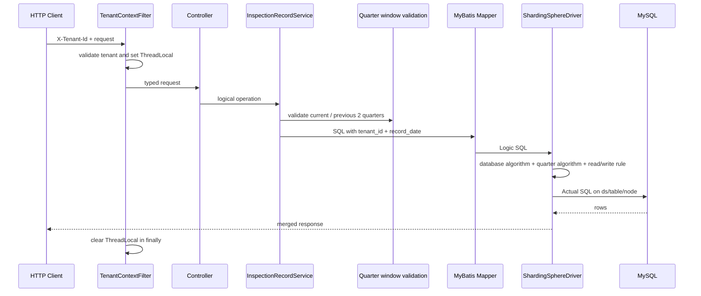

# 代码导读与断点路线

建议按 `legacy → product 标准版 → product 大客户版 → 季度轮转` 的顺序学习。核心不是背 YAML，而是能证明一条请求经过了：**租户校验 → 热窗口校验 → 选库 → 选季度表 → 选主从 → 执行**。

## 一、请求链路



职责边界：

- Service 负责业务窗口：在线新增只允许当前季度；在线查询只允许当前季度和前两个季度。
- `ProductDataSourceConfiguration` 负责在启动时选择标准版或大客户版规则，不负责搬数据。
- `TenantDatabaseShardingAlgorithm` 只在大客户版按 tenant_id 选库。
- `FixedQuarterShardingAlgorithm` 完成 Q1→q1…Q4→q4，并做热窗口防御；Service 仍负责可读业务错误和“新增仅当前季度”。
- ShardingSphere 的读写规则负责 primary/replica 选择。
- MySQL 负责索引、事务和复制；ShardingSphere 不创建复制关系。

## 二、推荐阅读顺序

### 第 1 站：profiles 与部署参数

先读：

```text
src/main/resources/application.properties
src/main/resources/application-legacy.properties
src/main/resources/application-product.properties
src/main/resources/application-sharding.properties
```

三种形态：

| 形态 | profile | 关键参数 | 行为 |
|---|---|---|---|
| 原始基线 | `legacy` | 无 | 直连 `asset_legacy.inspection_record` |
| 标准版 | `product` | `sharding.enabled=false` | 所有租户共享 ds_0，仍按季度分表 |
| 大客户版 | `product` | `sharding.enabled=true` | 按 tenant_id 分库，再按季度分表 |
| 兼容别名 | `sharding` | 默认开启 | 用于兼容早期启动命令 |

重点参数：

```properties
sharding.enabled=false
sharding.sharding-key=tenant_id
demo.sharding.current-quarter=2026Q3
demo.sharding.retained-quarter-count=3
demo.sharding.purge-grace-days=3
```

`sharding.enabled` 只在启动时选择拓扑。项目不提供配置中心热刷新或运行期切换 API。`sharding.sharding-key` 必须是 `tenant_id`，配置其他字段应启动失败。

### 第 2 站：两份 ShardingSphere YAML

按以下顺序读：

1. `dataSources`：物理 primary/replica 地址和连接池。
2. `!READWRITE_SPLITTING`：物理节点如何组成 ds_0、ds_1。
3. `actualDataNodes`：每个库固定只有 q1～q4。
4. `databaseStrategy`：只在 `shardingsphere-tenant.yaml` 调用 `TenantDatabaseShardingAlgorithm`。
5. `tableStrategy`：两种产品规则都调用 `FixedQuarterShardingAlgorithm`。
6. `keyGenerateStrategy`：Snowflake ID。
7. `auditStrategy`：DML 缺分片条件时尽早失败。
8. `sql-show`：输出 Logic/Actual SQL。

面试时不要说“YAML 开关会自动迁移”。它只是让**新启动实例**选择一种路由规则。

### 第 3 站：两个自定义算法

```text
src/main/java/com/example/assetinspection/algorithm/tenant/TenantDatabaseShardingAlgorithm.java
src/main/java/com/example/assetinspection/algorithm/quarter/FixedQuarterShardingAlgorithm.java
```

阅读 `TenantDatabaseShardingAlgorithm` 时回答：

- 关闭分库时，为什么任意 tenant 都必须返回 ds_0？
- 开启分库时，偶数/奇数 tenant 如何映射？
- 为什么缺 tenant_id 不能由算法“猜一个库”？
- 为什么 `floorMod` 比直接 `%` 对异常负值更明确，业务层为何仍应拒绝非正 tenantId？

阅读 `FixedQuarterShardingAlgorithm` 时回答：

- `record_date` 如何得到日历季度？
- 为什么 Q1 永远对应 q1，而不是动态改表名？
- 范围查询如何得到所覆盖季度的最小槽位集合？
- 为什么算法和 Service 都校验窗口？算法保护 JDBC 路由，Service 提供稳定业务错误并区分“历史可读”与“新增只写当前季度”。

### 第 4 站：季度窗口校验

沿着 `InspectionRecordService` 的新增、详情、列表、统计和更新方法查找季度校验调用。

当前季度 `2026Q3` 时：

- 新增允许 `2026Q3`。
- 新增 `2026Q2`、`2026Q4` 均拒绝。
- 查询允许 `2026Q1`～`2026Q3`。
- 查询 `2025Q4` 或 `2026Q4` 拒绝，不能让它们分别误落已复用/待命 q4。

这是四槽位方案的业务安全门。算法负责表名，Service 负责时间语义，两者不能只保留一个。

### 第 5 站：租户上下文

```text
TenantContextFilter.java
TenantContextHolder.java
```

- `/api/inspection-records/**` 强制携带 `X-Tenant-Id`。
- tenant 从认证/可信上下文获取，而不是允许请求体任意指定。
- Mapper SQL 仍必须显式带 `tenant_id`；ThreadLocal 不会自动变成分片条件。
- `finally` 清理 ThreadLocal，避免线程池复用串租户。

### 第 6 站：Controller、Service、Mapper

| 接口 | 学习目标 |
|---|---|
| `POST /api/inspection-records` | 只写当前季度；精确一库一表；写 primary |
| `GET /{id}` | 普通读 replica |
| `GET /{id}/strong` | 事务读 primary |
| `GET /{id}/hint-primary` | Hint 强制 primary，并正确释放 ThreadLocal Hint |
| `GET /api/inspection-records` | 热窗口、跨季度裁剪、复合游标 |
| `GET /statistics` | 分片局部聚合与归并 |
| `PATCH /{id}/result` | tenant + date 路由、id 定位、version 乐观锁 |
| `/api/debug/routes/unsafe-without-date/{id}` | 缺日期导致同库 4 表广播 |

检查 `InspectionRecordMapper.xml` 时做“三条件检查”：

| 条件 | 用途 | 缺失结果 |
|---|---|---|
| `tenant_id` | 分库和租户隔离 | 大客户模式跨库广播，并带来越权风险 |
| `record_date`/范围 | 固定季度表路由 | q1～q4 广播 |
| `id`/业务过滤 | 行定位 | 即使库表正确也可能扫描大量行 |

额外观察 `@@server_id` 和 `DATABASE()`，它们是证明实际节点的数据库侧证据。

### 第 7 站：季度运维脚本

```text
scripts/quarter-rollover.sh
```

脚本支持 PREPARE、ACTIVATE、RELEASE-CHECK、EXPIRE、PURGE 分阶段检查和 dry-run。默认原则：

- PREPARE 在本地检查待命表为空、结构/索引一致；生产部署平台还要检查归档目标、容量和变更单。
- ACTIVATE 在执行模式下先把空槽位绑定为新季度并标记 `ACTIVE`，随后输出需要更新的 `demo.sharding.current-quarter`；发布系统再更新部署配置并滚动重启。
- RELEASE-CHECK 在发布前核对在线三季度的槽位绑定、数据年份季度、表结构和主从 GTID。
- PURGE 检查 3 天宽限和数据归属，并要求归档、对账、流量栅栏、可恢复备份与人工确认；不应仅凭日期自动清空。
- 脚本默认只检查并输出下一步，不擅自改 `.env`，也不直接执行危险 DDL。

### 第 8 站：迁移与 Docker

迁移按旧表 ID 游标读取，按 tenant + record_date 写入目标季度表。重复批次必须幂等，对账至少按 tenant + business quarter 进行。

Docker 脚本负责 MySQL GTID/复制和 read_only。面试要明确：ShardingSphere 使用已存在的主从拓扑，不负责 `CHANGE REPLICATION SOURCE TO`。

## 三、推荐断点

以大客户模式、tenant 3、新增 `2026-07-18` 为例。

### 断点 1：`TenantContextFilter#doFilterInternal`

观察 Header、解析后的 tenantId=3、ThreadLocal 设置与 finally 清理。

### 断点 2：部署配置启动校验

分别用以下配置启动：

```text
enabled=false, sharding-key=tenant_id → 成功，SHARED_DATABASE
enabled=true,  sharding-key=tenant_id → 成功，TENANT_DATABASE
enabled=true,  sharding-key=asset_id  → 启动失败
```

确认开关只在容器构建/应用启动阶段读取。

### 断点 3：新增的季度校验

在 Service 中观察：

```text
currentQuarter = 2026Q3
recordDate = 2026-07-18
businessQuarter = 2026Q3
```

将日期改为 2026-06-30，应在进入 Mapper 前被拒绝，因为新增只能写当前季度。

### 断点 4：数据库算法

传入可用目标 ds_0、ds_1 和 tenantId=3：

- 标准版返回 ds_0。
- 大客户版返回 ds_1。

Controller 和 Mapper 不应拼接数据源名。

### 断点 5：季度算法

`2026-07-18` → month 7 → Q3 → `inspection_record_q3`。注意年份用于 Service 窗口校验，不进入槽位后缀。

### 断点 6：INSERT 与同事务回读

大客户模式应看到：

```text
ds1_primary ::: INSERT INTO inspection_record_q3 ...
ds1_primary ::: SELECT ... FROM inspection_record_q3 ...
```

标准版相同请求应改为 ds0_primary。

### 断点 7：普通/事务/Hint 详情

大客户模式 tenant 3：

- 普通读 server-id 201。
- `@Transactional` 读 server-id 101。
- Hint 读 server-id 101；退出 `try-with-resources` 后 Hint 被清理。

### 断点 8：跨季度查询

`[2026-06-29, 2026-07-02)` 同时覆盖 2026Q2、Q3。数 Actual SQL 应只有 q2、q3。

### 断点 9：过期/未来季度

当前 2026Q3 时分别查询 2025Q4、写入 2026Q4。它们都应在业务层失败，不能进入 Mapper。

### 断点 10：广播反例

缺 record_date 但有 tenant_id：

- 标准版：ds_0 × q1～q4。
- 大客户版：先选 tenant 库，再在该库广播 q1～q4。

## 四、IDE 启动配置

### Legacy

```text
Main: com.example.assetinspection.AssetInspectionApplication
Profile: legacy
```

### Product / Standard

```text
Profile: product
Arguments: --sharding.enabled=false --demo.sharding.current-quarter=2026Q3
```

### Product / Tenant Sharded

```text
Profile: product
Arguments: --sharding.enabled=true --sharding.sharding-key=tenant_id --demo.sharding.current-quarter=2026Q3
```

三个进程不要同时占用 18080；要并行比较就给其中一个指定 `--server.port=18081`。

## 五、读完应能回答

- 为什么标准版仍有四张季度表，却只有一个逻辑库？
- 为什么分库开关只能在部署启动时决定？
- `sharding.sharding-key` 为什么不是任意字段开关？
- Q1→q1 的固定映射如何避免轮转错乱？
- 为什么仍需要业务层按年份校验 ACTIVE 窗口？
- current + previous 2 为什么是约 6～9 个月，不是固定 9 个月？
- 为什么季度切换通过配置发布和滚动重启，而非热刷新？
- 为什么 EXPIRED 后还要等 3 天、归档、对账、人工确认？
- 为什么普通 SELECT 可能读到旧值？
- 如何用 Actual SQL 和 server-id 同时证明库、表、主从路由？

能结合代码、配置和实验回答，再进入面试话术。
