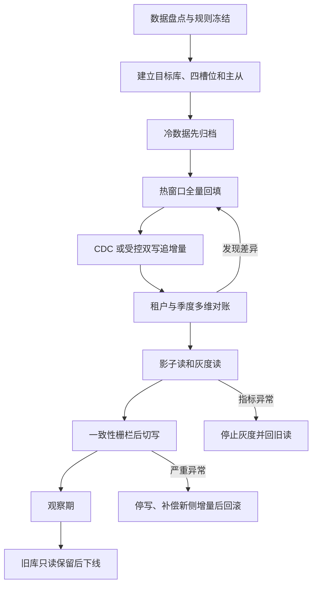

# 历史数据迁移、季度轮转与生产化

分片算法能正确选库选表，只代表路由层成立。生产改造还必须回答：旧数据怎么搬、冷数据放哪里、季度边界怎么推进、三天后由谁清理、两种产品形态怎么切换、失败后如何回滚，以及容量结论如何证明。

## 1. 先统一三个概念

### 1.1 legacy

`legacy` 是改造前的原始单库单表：`asset_legacy.inspection_record`。它在 Demo 中承担对照组和迁移源端，不是客户最终使用的第三种产品模式。

### 1.2 product 标准版

```properties
sharding.enabled=false
```

标准版仍经过 ShardingSphere-JDBC，只是不按租户拆库。它使用一个共享库、q1～q4 四个固定季度槽位和一主一从。

### 1.3 product 大客户版

```properties
sharding.enabled=true
sharding.sharding-key=tenant_id
```

大客户版通过 `TenantDatabaseShardingAlgorithm` 按租户选择数据库，每个分片库仍使用相同的四槽位和读写分离规则。

这两个配置不是运行期功能开关。部署完成后若要从共享库升级为租户分库，必须先迁移存量数据，再通过发布重启切换拓扑。

## 2. Demo 迁移组件的定位

迁移组件默认关闭：

```properties
demo.migration.enabled=false
```

在 `product` 模式临时开启后，应用同时持有：

- 主 DataSource：ShardingSphere 逻辑数据源，写入标准版或大客户版目标拓扑；
- `legacy` 只读 DataSource：直连 `asset_legacy.inspection_record`，用于回填和旧侧对账。

教学实现按旧表主键游标分批读取，保留原始 ID，再让目标 Mapper 根据 `tenant_id + record_date` 完成路由。它能演示：

- 深分页为什么不适合大表迁移；
- 为什么迁移要保留旧主键；
- 如何用幂等写和检查点重试；
- 如何按租户和季度窗口对账；
- 本地事务为什么不能被误解为跨新旧库全局事务。

它不能替代生产的 CDC、持久化任务调度、分布式锁、流量控制、字段级校验平台和自动告警。

## 3. 迁移只接收在线热窗口数据

当前 Demo 的目标季度算法只允许：

```text
current-quarter + 前两个季度
```

例如 `CURRENT_QUARTER=2026Q3` 时，目标在线范围是：

```text
[2026-01-01, 2026-10-01)
```

`LegacyMigrationService` 在每行写入前复用 `ShardingRangeValidator`。早于热窗口的记录会被拒绝，不能因为表后缀碰巧相同就写入正在承载新年份的槽位。

因此真实迁移必须先分流：

```text
旧单表
├── 在线热窗口数据 → ShardingSphere 目标季度表
└── 更早冷数据     → 归档库、对象存储或离线查询体系
```

冷数据去向要在切换前确定。不能先清旧表，再讨论历史查询如何实现。若法规要求长期在线检索，可增加独立归档服务；不要破坏固定四槽位的热数据边界。

## 4. 本地迁移演示

### 4.1 启动数据库和检查复制

```bash
./scripts/start-databases.sh
./scripts/check-replication.sh
```

### 4.2 以标准版目标启动

```bash
CURRENT_QUARTER=2026Q3 SHARDING_ENABLED=false \
mvn spring-boot:run \
  -Dspring-boot.run.profiles=product \
  -Dspring-boot.run.arguments=--demo.migration.enabled=true
```

此时旧数据回填到共享库中的 q1、q2、q3。

### 4.3 以大客户版目标启动

```bash
CURRENT_QUARTER=2026Q3 SHARDING_ENABLED=true \
mvn spring-boot:run \
  -Dspring-boot.run.profiles=product \
  -Dspring-boot.run.arguments=--demo.migration.enabled=true
```

此时偶数租户进入 ds_0，奇数租户进入 ds_1。旧的 `sharding` profile 只保留为兼容别名，正式部署应使用 `product + SHARDING_ENABLED`，让部署语义更清楚。

### 4.4 执行一个批次

```bash
curl -sS -X POST \
  'http://localhost:18080/api/admin/migrations/legacy/batches?afterId=0&batchSize=500'
```

返回示例：

```json
{
  "requestedAfterId": 0,
  "readRows": 6,
  "insertedRows": 6,
  "ignoredRows": 0,
  "nextAfterId": 8000000000000006,
  "hasMore": false
}
```

如果 `hasMore=true`，调用方在确认本批成功后持久化 `nextAfterId`，下一批把它作为 `afterId`。不能在目标提交成功前推进检查点，否则进程中断会造成漏迁。

### 4.5 重跑验证幂等

再次用相同 `afterId` 执行。迁移 SQL 使用 `INSERT IGNORE` 并保留旧 ID，已存在记录应计入 `ignoredRows`。

但“被忽略”不等于“字段一定一致”。若相同 ID 已存在但其他字段不同，仍需字段级校验并告警。

### 4.6 按租户和季度范围对账

```bash
curl -sS \
  'http://localhost:18080/api/admin/migrations/legacy/reconciliation?tenantId=2&startDate=2026-01-01&endDateExclusive=2026-04-01'
```

目标 COUNT 同时携带 `tenant_id` 和日期范围，只访问对应租户库和 q1；事务内查询按 `PRIMARY` 策略读主库，避免复制延迟制造假差异。

迁移管理接口在 Demo 中没有管理员认证，只能用于本机教学。生产必须置于内网管理面，并加入鉴权、审计、任务互斥、限流和操作人留痕。

## 5. 为什么使用主键游标

不推荐深 OFFSET：

```sql
SELECT ...
FROM inspection_record
ORDER BY id
LIMIT 500 OFFSET 10000000;
```

数据库需要扫描并丢弃大量前置记录，越往后越慢；迁移期间有新增或删除时，页边界还可能漂移。

推荐：

```sql
SELECT ...
FROM inspection_record
WHERE id > :afterId
ORDER BY id
LIMIT :batchSize;
```

它利用主键索引从上一个稳定位置继续。若旧主键不单调或会修改，应使用稳定、唯一、不可变的复合游标，例如 `(created_at, id)`。

## 6. 本地事务的真实边界

一个批次包含旧 DataSource 读取和目标 DataSource 写入，普通 Spring 本地事务无法原子覆盖两边。大客户版中，如果同一批混入多个租户，目标写还可能同时命中 ds_0 和 ds_1。

Demo 的收敛手段是：

- 旧侧只读；
- 目标使用保留主键的幂等写；
- 方法正常返回后才推进检查点；
- 提交结果不确定时，从上一个确认游标重跑；
- 最终通过多维对账发现差异并补偿。

生产任务更适合按“租户 × 季度 × 主键区间”拆分，使一个工作单元尽量只命中一个目标库。大规模离线回填通常优先使用幂等、检查点和对账，而不是持有超长分布式事务。

## 7. 四个固定季度槽位的生命周期

每个目标 schema 都有 `inspection_quarter_slot`：

| 字段 | 含义 |
|---|---|
| `slot_no` | 固定槽位 1～4 |
| `physical_table` | `inspection_record_q1`～`inspection_record_q4` |
| `bound_quarter` | 当前绑定的业务季度，如 `2026Q3` |
| `slot_status` | `EMPTY / ACTIVE / EXPIRED` |
| `activated_at` | 本轮启用时间 |
| `expired_at` | 退出在线窗口的时间 |
| `cleanup_after` | 最早允许清理的时间 |

状态含义：

```text
EMPTY   ：表必须为空，可以供对应的下一年季度复用
ACTIVE  ：当前或前两个季度的在线热数据
EXPIRED ：已退出在线路由，但仍在宽限期或等待人工清理
```

元数据是运维控制事实，不代替 ShardingSphere 的路由规则；反过来，路由算法也不会自动更新元数据或清空表。

项目提供 `scripts/quarter-rollover.sh` 作为安全流程的可执行教学实现：

```bash
./scripts/quarter-rollover.sh status
./scripts/quarter-rollover.sh prepare 2026Q4
./scripts/quarter-rollover.sh activate 2026Q4
./scripts/quarter-rollover.sh release-check 2026Q4
./scripts/quarter-rollover.sh expire 2026Q1
./scripts/quarter-rollover.sh purge 2026Q1
```

`status`、`prepare` 和 `release-check` 永远只读；`activate`、`expire`、`purge` 默认也只是 dry-run。真正修改元数据要追加 `--execute`。`purge` 还必须同时提供季度二次确认、归档确认、对账确认、流量栅栏确认和可恢复备份确认：

```bash
./scripts/quarter-rollover.sh purge 2026Q1 --execute \
  --confirm-quarter=2026Q1 \
  --archive-confirmed \
  --reconciliation-confirmed \
  --traffic-fenced-confirmed \
  --backup-confirmed
```

脚本会校验两个目标主库的元数据一致性、固定槽位映射、表结构、数据所属年份季度和主从 GTID；它不会修改 `CURRENT_QUARTER`、不会重启应用，也不会在缺少确认时执行清空。生产环境仍应把审批、真实备份恢复、连接/长事务检测和监控检查接入正式 DBA 变更平台。

## 8. 一次完整季度轮转

下面以从 `2026Q3` 进入 `2026Q4` 为例。切换前：

```text
q1 = 2026Q1 ACTIVE
q2 = 2026Q2 ACTIVE
q3 = 2026Q3 ACTIVE
q4 = EMPTY
CURRENT_QUARTER = 2026Q3
```

### 8.1 PREPARE：准备 q4

至少检查：

- 所有目标库的 q4 都为空；
- q4 的字段、索引、字符集和约束与其他槽位一致；
- q4 没有旧年份残留绑定；
- q1 已完成冷归档和归档对账；
- 主从复制健康，磁盘、binlog 和备份空间充足；
- 应用发布包与 `CURRENT_QUARTER=2026Q4` 配置已准备好。

任一目标库的同名槽位不满足条件，都不能继续。大客户版必须让 ds_0、ds_1 保持一致的槽位状态，不能只操作一个库。

Demo 中先执行只读检查：

```bash
./scripts/quarter-rollover.sh prepare 2026Q4
```

### 8.2 ACTIVATE：绑定新季度

将 q4 绑定为 `2026Q4` 并标记 `ACTIVE`。这一步只表示物理目标已经准备好，不代表旧应用实例已经会接受 Q4 写入。

复核 dry-run 输出后才真正执行：

```bash
./scripts/quarter-rollover.sh activate 2026Q4 --execute
```

此阶段槽位元数据会暂时有四个 `ACTIVE`。首次 Q4 写入前 q4 仍可能为空；新季度开始写入后，四个槽位可能同时非空。固定四表方案允许这种受控过渡，不能再宣称宽限期内永远有一张空表。

### 8.3 发布 CURRENT_QUARTER 并滚动重启

先执行只读发布门禁：

```bash
./scripts/quarter-rollover.sh release-check 2026Q4
```

门禁会验证两个目标库元数据一致，Q2/Q3/Q4 均绑定为正确的 `ACTIVE` 槽位，表内现有数据年份季度正确，且副本已追平当前 GTID。路由算法不会在每个业务请求中查询运维表，所以这一步应固化到部署流水线；不能只靠工程师记住执行顺序。

部署环境改为：

```text
CURRENT_QUARTER=2026Q4
```

然后滚动重启 `product` 实例。启动时 Spring 将同一个季度值交给业务校验和 `FixedQuarterShardingAlgorithm`。新实例的在线窗口变为：

```text
2026Q2、2026Q3、2026Q4
```

新旧实例短暂混跑时：旧实例仍只接受 Q3 普通新增，新实例只接受 Q4 普通新增。因此发布必须结合负载均衡摘流、健康检查、队列消费暂停或业务切换时间点，尽快让所有写流量收敛到新规则；不能只改配置中心而不重启，也不能允许两个季度配置长期并存。

### 8.4 EXPIRE：标记最老季度

确认所有实例已经使用 Q4、没有在途 Q1 在线查询或任务后，将 q1 的 `2026Q1` 标记为 `EXPIRED`：

```text
expired_at = 实际过期时间
cleanup_after = expired_at + 3 天
```

对应命令是：

```bash
./scripts/quarter-rollover.sh expire 2026Q1 --execute
```

新的固定季度算法已经把 Q1 排除在热窗口之外，在线查询不会再路由到 q1；但物理数据仍保留，提供误切换发现和回滚缓冲。

### 8.5 GRACE：至少三天宽限

三天是“最早允许清理”的业务策略，不是到了时间自动执行 `TRUNCATE`。宽限期内必须持续观察：

- 是否仍有旧实例或离线任务访问 q1；
- 归档总数、分组数量和抽样字段是否一致；
- 是否有迟到事件需要受控补录；
- primary/replica 是否追平；
- 是否有投诉、查询缺失或回滚需求。

生产可以把宽限天数做成运维参数，但修改前要经过数据保留和回滚风险评审。Demo 不提供后台定时自动清理，避免教学脚本在错误季度不可逆删除数据。

### 8.6 PURGE：人工门禁后清空

只有同时满足以下条件才允许清理：

- 当前时间不早于 `cleanup_after`；
- 冷归档和多维对账通过；
- 无活跃连接、长事务、在途任务和旧版本实例访问 q1；
- 备份存在且做过可恢复性验证；
- 各目标库、主从复制和元数据状态一致；
- 变更单经过双人复核并明确回滚负责人。

清理应在 primary 上通过受控 DBA 流程执行，让复制链路同步到 replica；确认表为空后，再将元数据恢复为：

```text
bound_quarter = NULL
slot_status = EMPTY
expired_at = NULL
cleanup_after = NULL
```

此时 q1 才真正成为未来 `2027Q1` 的待命空槽位。

## 9. 轮转失败时如何回滚

### 9.1 尚未产生 Q4 写入

可以摘除新实例，恢复 `CURRENT_QUARTER=2026Q3`，将误激活但仍为空的 q4 恢复为 `EMPTY`。回滚前仍要确认没有任何 Q4 行。

### 9.2 已经产生 Q4 写入，但 q1 尚未清理

不能直接把配置退回 Q3 后假装完成。需要先暂停写入，决定 Q4 数据是保留、转存还是反向同步，并对 q3/q4 的业务事件做一致性校验。q1 尚在可以保护历史查询，但 Q4 新增数据已经构成新的事实。

### 9.3 q1 已经清理

这已越过高风险不可逆点。恢复 Q1 只能依赖归档或备份，所以 PURGE 前的恢复演练比“有备份文件”更重要。

### 9.4 某个分片成功、另一个分片失败

两个独立 MySQL 实例之间不存在一个普通本地事务；尤其 `TRUNCATE` 会隐式提交，所以 ACTIVATE、EXPIRE、PURGE 都不能伪装成跨库原子操作。教学脚本发现 ds_0/ds_1 状态不一致时会失败关闭，防止继续扩大影响，但它不冒充生产变更编排系统。

生产落地应由 DBA/发布平台记录“变更单号 + 季度 + 每个分片的阶段 + 操作结果”，每一步设计成幂等或带补偿，并提供按分片续跑/回退命令。若 PURGE 只成功一库，应立即保持流量栅栏，根据操作日志和备份完成另一库续跑或恢复；不能手工修改元数据掩盖差异。

## 10. 迟到数据和冷查询

普通新增 API 只允许写 `current-quarter`。这是为了避免旧季度槽位临近过期时仍不断接收新数据。

迟到上报建议设计独立链路：

1. 校验业务原因和目标季度；
2. 判断目标仍在热窗口还是已经归档；
3. 热窗口内走受控补录并记录审计；
4. 已归档数据写入冷数据体系，必要时更新预聚合；
5. 对重复 requestId、业务状态和统计口径重新对账。

历史查询也应明确区分：

```text
热窗口查询 → 在线 inspection_record 逻辑表
冷数据查询 → 归档接口或异步报表
```

不要把超出窗口的请求偷偷截断成部分结果；应明确返回“请走归档查询”。

## 11. 从 legacy 到产品拓扑的生产迁移阶段



### 11.1 数据盘点

至少统计：

- 各租户、各季度的行数和存储量；
- 最大租户、增长最快租户和数据倾斜；
- 日期为空、越界或与 `inspected_at` 不一致的脏数据；
- 主键、唯一键、关联表和删除语义；
- Top SQL、查询窗口和跨租户访问比例；
- 热数据、冷数据的明确分界与合规保留要求。

### 11.2 建立目标节点

- 用统一 DDL 创建 q1～q4 和 `inspection_quarter_slot`；
- 校验所有库的结构 hash、索引、字符集和排序规则；
- 建立 primary → replica 复制并开启只读保护；
- 预估连接数、磁盘、binlog、备份和临时空间；
- 按目标 `CURRENT_QUARTER` 正确绑定三个热槽位，剩余槽位必须为空。

ShardingSphere 的 `actualDataNodes` 只是声明可路由节点，不会替 DBA 创建表。

### 11.3 全量回填

任务按“租户 × 季度 × 主键区间”切分：

- 单任务失败影响范围小；
- 可按客户和目标库限速；
- 检查点、重跑和对账边界清晰；
- 可先迁移低风险租户做灰度。

每批记录 batch id、输入区间、读取数、插入数、忽略数、耗时、目标库表和错误样本。脏数据进入死信或隔离表，不能无限重试拖垮全任务。

### 11.4 增量追平

全量回填期间旧系统仍在写入，可选：

- CDC/binlog：业务侵入小，但要治理位点、重复、乱序、删除、DDL 和积压；
- 应用双写：业务语义清楚，但两个目标不能依靠本地事务天然原子，需要 outbox、重试、死信和差异扫描。

切写前必须证明增量追到明确位点，不能用“看起来差不多”代替一致性栅栏。

### 11.5 影子读与灰度

影子读仍返回旧链路结果，同时异步查询新链路比较。灰度可按内部租户、小租户、流量比例逐级扩大。

每一级都要设置准入和退出条件：结果差异率、错误率、P95/P99、连接池等待、复制延迟、CPU/IO 和实际路由节点数。先灰度读，再切写。

### 11.6 切写与旧库保留

切写前：

1. 冻结旧写或记录最终日志位点；
2. 等待增量追平；
3. 做最终多维对账；
4. 切换写入口；
5. 用 canary 写入和主库强一致读验证真实节点。

旧库先只读保留。已经切到新库写入后，直接退回旧库会丢失新侧增量；回滚前必须反向同步或停写回灌并再次对账。

## 12. 标准版升级为租户分库版

同一套代码支持两种形态，不代表存量客户可以无数据迁移升级。升级步骤应是：

1. 冻结目标分片规则和 `shard-count`；
2. 创建各租户分片库、四槽位和主从；
3. 从标准版共享库按 `tenant_id + record_date` 回填目标；
4. 承接共享库增量；
5. 按租户和季度对账；
6. 影子读验证自定义租户算法；
7. 建立切写栅栏；
8. 发布 `SHARDING_ENABLED=true` 并重启；
9. 保留共享库只读回滚窗口。

部署配置的价值是减少代码分支和交付包数量，不是消除数据重分布成本。

## 13. 多维对账

只比较总 COUNT 可能掩盖“一个季度少、另一个季度多”。至少执行：

1. 总行数；
2. `tenant_id + 业务季度` 行数；
3. 每个窗口的 `MIN(id)`、`MAX(id)`；
4. 按 `status` 等业务字段分组数量；
5. 可加总数值字段的 SUM，并统一 NULL 与精度语义；
6. 稳定字段按主键排序后的分块 checksum；
7. 头部租户、边界日期和随机记录逐行抽样；
8. `record_date = DATE(inspected_at)` 等业务不变量；
9. 源端、primary、replica 三侧的复制一致性。

差异记录必须带租户、季度、主键区间和字段名，才能精确补偿。

## 14. 容量与性能验证

“多数客户 1～3 个租户、单季度表 500～1500 万行”可以作为标准版容量假设，但不是数据库性能承诺。

### 14.1 同数据量建立基线

在相同硬件、索引、数据分布和缓存预热条件下比较 legacy 与 product：

- 吞吐量和错误率；
- P50、P95、P99；
- 扫描行数、回表、排序、临时表和慢查询；
- MySQL CPU、IOPS、Buffer Pool 命中；
- 连接池 active/pending/timeout；
- replica 延迟；
- 每条逻辑 SQL 的实际路由节点数。

不能拿多年真实数据的 legacy 与几条种子数据的新表比较后宣称性能大幅提升。

### 14.2 测试矩阵

- 单租户单季度精确查询；
- 单租户跨三个热季度查询；
- 缺日期条件的广播反例；
- 普通租户与头部租户；
- 500 万、1000 万、1500 万以及预留增长量级；
- 混合读写、复制延迟和 replica 故障；
- 游标分页与深分页；
- 跨表聚合与结果归并。

最终阈值应绑定硬件规格、典型 SQL 和 SLO。例如只有在“某规格下 Top SQL 的 P99、错误率和数据库利用率均达标”时，才能认为 1500 万行仍在安全区。

### 14.3 连接池乘法效应

标准版包含主、从两个物理池；大客户版 Demo 包含两组主从，共四个物理池，外层还有逻辑池。应用实例数量增加时，总连接预算会被一起放大。

生产需按应用实例数、每池上限、查询耗时和数据库 `max_connections` 统一计算，不能机械复制较大的连接池配置。

## 15. 生产监控

### 应用与 ShardingSphere

- 接口 QPS、错误率、P95/P99；
- 逻辑池与物理池使用率、等待和超时；
- 事务时长；
- Logic SQL 对应的 Actual SQL 数量；
- 广播路由异常；
- Hint 强制主库比例；
- 各实例的 `SHARDING_ENABLED` 和 `CURRENT_QUARTER` 配置一致性。

### MySQL

- primary/replica 存活与只读状态；
- GTID、复制线程、复制错误和位点延迟；
- CPU、内存、IO、磁盘与 binlog 增长；
- 连接、锁等待、死锁和慢查询；
- 各库各季度表的行数、大小和热点。

### 生命周期和业务正确性

- 四个槽位的绑定、状态和表实际行数是否一致；
- 同一槽位是否出现错误年份混放；
- `cleanup_after` 已到但未清理的积压；
- 冷归档与在线侧对账差异；
- 重复 requestId、迟到补录和日期不变量违规；
- 迁移检查点、CDC 位点和灰度差异率。

`sql-show: true` 适合教学验证。生产全量输出可能产生大量日志并暴露参数，应关闭或采样，用指标化路由审计代替。

## 16. 高可用边界

ShardingSphere-JDBC 不会创建 MySQL 复制，也不会在 primary 宕机后自行完成数据库选主和地址治理。

生产通常组合云数据库、MGR、Orchestrator 或其他数据库控制面完成故障检测和切换，再通过稳定域名、代理或治理配置让连接池恢复。需要定期演练：

- replica 是否真的可提升；
- 新主库是否完整追平；
- 应用连接是否能摘除旧节点并重建；
- 故障期间季度路由和槽位元数据是否仍一致；
- RTO/RPO 是否符合业务目标。

## 17. 上线检查清单

### 数据与规则

- [ ] `sharding.enabled` 与目标客户形态一致，部署后不热改。
- [ ] 分库键固定为 `tenant_id`，所有在线 SQL 都有租户条件。
- [ ] `CURRENT_QUARTER` 在所有实例和 YAML 算法中一致。
- [ ] q1～q4 结构、索引和元数据在所有库一致。
- [ ] 普通新增只允许当前季度，迟到补录有独立流程。
- [ ] 冷数据已有可验证的归档和查询路径。

### 迁移与灰度

- [ ] 全量检查点可恢复，目标写幂等。
- [ ] 增量位点可证明追平。
- [ ] 租户、季度、字段和 checksum 对账通过。
- [ ] 影子读与灰度退出阈值明确。
- [ ] 切写和写回滚方案演练通过。

### 季度轮转

- [ ] 新季度槽位为空且结构正确。
- [ ] 最老季度已归档并对账。
- [ ] 滚动重启的摘流和混跑控制已演练。
- [ ] EXPIRED 的三天宽限不会自动触发清理。
- [ ] PURGE 有时间、备份、在途任务、复制和双人复核门禁。

### 性能与运维

- [ ] 500～1500 万行结论有同规格压测数据支撑。
- [ ] P95/P99、错误率和数据库利用率达标。
- [ ] 广播路由、连接预算和复制延迟监控有效。
- [ ] 备份恢复、单节点故障和季度轮转均做过演练。

## 18. 面试概括

> 我把 legacy 定义为改造前的单库单表，只用于迁移源和压测基线。迁移时先按当前加前两个季度筛出热数据，按主键游标幂等回填；更早数据进入冷归档。标准版和租户分库版共用业务代码，但 `sharding.enabled` 只在部署启动时选择 YAML，存量升级仍必须迁移和对账。季度轮转先确认待命槽位为空并激活新季度，再发布 CURRENT_QUARTER、滚动重启、把最老季度标记 EXPIRED；三天只是最早清理时间，归档、对账、在途任务、备份和复制检查通过后才人工清空。容量方面，500～1500 万行只是初始客户画像，必须用真实数据和 Top SQL 验证 P99，不能把行数直接等同于性能结论。
